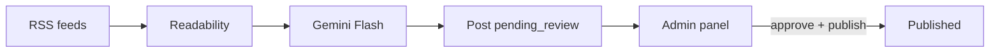

# No Promete

Sitio satírico de noticias costarricenses. Consume RSS, genera borradores con Gemini Flash, y requiere aprobación humana antes de publicar. Siempre enlaza la fuente original.

## Stack

- Next.js 16 (App Router) + TypeScript
- Tailwind CSS 4
- **Neon** (Postgres) + Drizzle ORM
- Google Gemini Flash para borradores
- Auth.js (credenciales) para `/admin`
- Vercel Cron → ingesta RSS

## Desarrollo

```bash
npm install
cp .env.example .env.local
# Completá DATABASE_URL (Neon pooled), AUTH_SECRET, ADMIN_PASSWORD, etc.
npm run db:push
npm run db:seed
npm run dev
```

Abrí [http://localhost:3000](http://localhost:3000). Panel admin: [http://localhost:3000/admin](http://localhost:3000/admin).

Sin `DATABASE_URL`, el sitio usa datos mock en `lib/mock/`.

## Rutas

| Ruta | Descripción |
|------|-------------|
| `/` | Home |
| `/noticias/[slug]` | Artículo con fuente original |
| `/categoria/[slug]` | Listado por sección |
| `/nosotros`, `/etica`, `/aviso-legal` | Páginas legales |
| `/admin` | Panel editorial |
| `/admin/login` | Login del editor |
| `/api/cron/ingest` | Ingesta RSS (protegida con `CRON_SECRET`) |

## Pipeline editorial



### Base de datos (Drizzle + Neon)

**sources** — feeds RSS configurables  
**raw_articles** — artículos ingeridos sin procesar  
**posts** — borradores y publicados:

`draft` → `pending_review` → `approved` → `published` | `rejected`

### Ingesta

- Vercel Cron una vez al día (8:00 a.m. hora Costa Rica) → `GET /api/cron/ingest`
- Header: `Authorization: Bearer <CRON_SECRET>`
- `rss-parser` + `@mozilla/readability` + `cheerio`
- Dedupe por `source_url`
- Máx. 3 artículos nuevos por ejecución
- **Nunca auto-publicar**

### Admin

- Login con `ADMIN_PASSWORD`
- Revisar borrador vs original
- Aprobar, rechazar, regenerar con LLM, publicar
- Botón de ingesta manual

## Scripts

| Comando | Descripción |
|---------|-------------|
| `npm run db:push` | Aplicar schema a Neon |
| `npm run db:seed` | Fuentes RSS + artículos mock publicados |
| `npm run db:studio` | Drizzle Studio |
| `npm run ingest -- --max=1` | Ingesta RSS local → Neon (requiere `GEMINI_API_KEY`) |

## Variables de entorno

```
DATABASE_URL=          # Neon pooled connection string
GEMINI_API_KEY=
GEMINI_MODEL=gemini-2.5-flash
CRON_SECRET=
AUTH_SECRET=
NEXTAUTH_URL=
ADMIN_PASSWORD=
```

## Deploy en Vercel

1. Conectá el repo y agregá las env vars
2. Integración Neon (opcional) o `DATABASE_URL` manual
3. `vercel.json` configura el cron de ingesta
4. En producción, `NEXTAUTH_URL` debe ser tu dominio

## Legal

Sitio de comentario y sátira. No somos medio original. Cada artículo enlaza la fuente citada.
