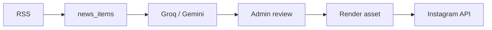

# No Promete

Marca social-first de comentario y sátira tica sobre noticias reales. El sitio público es un **link hub**; el producto vive en Instagram/TikTok y en el **panel editorial** (`/admin`).

## Stack

- Next.js 16 (App Router) + TypeScript
- Tailwind CSS 4
- **Neon** (Postgres) + Drizzle ORM
- **Groq** o Google Gemini (borradores sociales, configurable)
- Auth.js + Basic Auth (opcional) para `/admin`
- Render de assets con `next/og` (Story / Feed)

## Desarrollo

```bash
npm install
cp .env.example .env.local
npm run db:push
npm run db:seed
npm run dev
```

- Público: [http://localhost:3000](http://localhost:3000)
- Admin: [http://localhost:3000/admin](http://localhost:3000/admin)

## Pipeline social (manual-first, free tier)



1. **Ingesta social** → `news_items` (dedupe por URL + título normalizado / 48h)
2. **Generar draft (1)** → Groq o Gemini → `social_drafts` (`needs_review`)
3. **Revisar / editar / aprobar** en `/admin/social/[id]`
4. **Renderizar asset** → URL pública firmada
5. **Programar** (opcional) o **Publicar story** (cuando `IG_*` esté configurado)

**Nunca auto-publicar** sin aprobación humana.

### Tablas principales

| Tabla | Rol |
|-------|-----|
| `sources` | Feeds RSS |
| `news_items` | Items ingeridos (lean) |
| `social_drafts` | Borradores + workflow + asset URL |

### Estados `social_drafts`

`needs_review` → `approved` → `scheduled` → `publishing` → `published` | `failed` | `rejected`

## Rutas

| Ruta | Descripción |
|------|-------------|
| `/` | Link hub (Instagram/TikTok, fuentes, disclaimer) |
| `/admin` | Panel social |
| `/admin/social/[id]` | Revisión de draft |
| `/api/assets/social/[id]` | Preview de imagen (token firmado) |
| `/api/cron/social-ingest` | Ingesta RSS social (`CRON_SECRET`) |

`/noticias/*` y `/categoria/*` redirigen a `/`.

## Variables de entorno

Ver [`.env.example`](.env.example). Mínimo:

- `DATABASE_URL`, `AUTH_SECRET`, `ADMIN_PASSWORD`, `NEXTAUTH_URL`
- **LLM:** `GROQ_API_KEY` + `SOCIAL_LLM_PROVIDER=groq` (o solo `GROQ_API_KEY` para auto) · `GROQ_MODEL=llama-3.3-70b-versatile`
- Alternativa: `GEMINI_API_KEY`, `GEMINI_MODEL`, `SOCIAL_LLM_PROVIDER=gemini`
- `NEXT_PUBLIC_INSTAGRAM_URL`, `NEXT_PUBLIC_TIKTOK_URL` (link hub)
- `ASSET_SIGNING_SECRET` (o fallback dev)
- `IG_ACCESS_TOKEN`, `IG_USER_ID` (cuando publiques a Instagram)
- `BASIC_AUTH_USER`, `BASIC_AUTH_PASSWORD` (recomendado en prod)
- `CRON_SECRET` (cron / endpoints internos)

## Skills (Cursor)

- `nopromete-editorial` — voz y campos
- `nopromete-social` — captions y redes
- `nopromete-social-pipeline` — pipeline RSS → Instagram

## Legal

Sitio de comentario y sátira. No somos medio original. Cada publicación enlaza la fuente citada.
